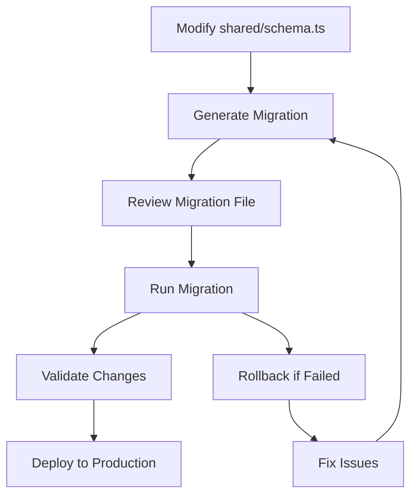

# Database Schema Management & Validation System

## Overview

This multi-tenant accounting application now includes a comprehensive database schema management and validation system. The system provides:

- **Type-safe schema definitions** using Drizzle ORM
- **Enhanced validation** with Zod schemas and business rules
- **Safe migration management** with rollback capabilities
- **Comprehensive health checking** and monitoring
- **Pre-insertion validation** to prevent data corruption

## Schema Architecture

### Core Components

1. **Schema Definition** (`shared/schema.ts`)
   - Drizzle ORM table definitions
   - Zod validation schemas
   - Enhanced business rule validation
   - TypeScript type inference

2. **Validation Service** (`server/db-validation.ts`)
   - Pre-insertion data validation
   - Database health monitoring
   - Schema integrity checking
   - Performance monitoring

3. **Migration Manager** (`server/migration-manager.ts`)
   - Safe schema changes
   - Rollback capabilities
   - Migration tracking
   - Backup creation

## How Schema Changes Work

### Current Workflow



### 1. Schema Definition Changes

When you need to alter the database schema:

```typescript
// shared/schema.ts
export const newTable = pgTable("new_table", {
  id: serial("id").primaryKey(),
  name: text("name").notNull(),
  // ... other fields
});
```

### 2. Generate Migration

```bash
npm run db:migrate generate "add_new_table"
```

This creates a migration file like `migrations/002_add_new_table.sql`:

```sql
-- UP
CREATE TABLE new_table (
  id SERIAL PRIMARY KEY,
  name TEXT NOT NULL
);

-- DOWN
DROP TABLE IF EXISTS new_table;
```

### 3. Run Migration

```bash
npm run db:migrate
```

## Database Validation System

### Enhanced Validation Schemas

The system includes business-rule validation beyond basic type checking:

```typescript
// Enhanced user validation
const insertUserSchemaEnhanced = insertUserSchema.extend({
  email: z.string().email("Invalid email format"),
  username: z.string().min(3).max(50),
  password: z.string().min(8),
  // ... additional validation
});

// Journal entry with accounting rules
const journalEntryWithLinesSchema = z.object({
  entry: insertJournalEntrySchemaEnhanced,
  lines: z.array(insertJournalEntryLineSchemaEnhanced)
}).refine((data) => {
  // Ensure debits = credits
  const totalDebits = data.lines.reduce(/* ... */);
  const totalCredits = data.lines.reduce(/* ... */);
  return Math.abs(totalDebits - totalCredits) < 0.01;
}, {
  message: "Total debits must equal total credits",
});
```

### Pre-Insertion Validation

Before any database insert/update:

```typescript
import { DatabaseValidationService } from "./server/db-validation";

// Validate user data
const validation = await DatabaseValidationService.validateUser(userData);
if (!validation.isValid) {
  throw new Error(`Validation failed: ${validation.errors.join(', ')}`);
}

// Safe to insert
const user = await db.insert(users).values(userData);
```

### Validation Middleware

For API routes:

```typescript
import { createValidationMiddleware } from "./server/db-validation";

app.post('/api/users', 
  createValidationMiddleware(insertUserSchemaEnhanced),
  async (req, res) => {
    // req.validatedBody contains validated data
    const user = await db.insert(users).values(req.validatedBody);
    res.json(user);
  }
);
```

## Database Health Monitoring

### Comprehensive Health Checks

```bash
npm run db:health
```

This checks:
- ✅ **Connection performance** (< 1s)
- ✅ **Query performance** (< 500ms)
- ✅ **All required tables exist**
- ✅ **Foreign key integrity**
- ✅ **Index optimization**
- ✅ **Orphaned records detection**

### Schema Information

```bash
npm run db:status
```

Provides:
- Migration status
- Table row counts
- Database size
- Performance metrics
- Recommendations

## CLI Commands

### Database Management

```bash
# Run all pending migrations
npm run db:migrate

# Check migration status
npm run db:migrate status

# Generate new migration
npm run db:migrate generate "migration_name"

# Database health check
npm run db:health

# Complete database status
npm run db:status

# Test schema validation
npm run db:validate

# Generate schema from code (development)
npm run db:generate

# Push schema directly (development only)
npm run db:push
```

## Migration Best Practices

### 1. Always Create Migrations for Schema Changes

❌ **Don't do this:**
```bash
npm run db:push  # Direct schema push
```

✅ **Do this:**
```bash
npm run db:migrate generate "add_user_preferences"
# Edit the migration file
npm run db:migrate
```

### 2. Migration File Structure

```sql
-- UP
-- Description of what this migration does
CREATE TABLE user_preferences (
  id SERIAL PRIMARY KEY,
  user_id INTEGER REFERENCES users(id) NOT NULL,
  preferences JSONB DEFAULT '{}',
  created_at TIMESTAMP DEFAULT NOW()
);

CREATE INDEX idx_user_preferences_user_id ON user_preferences(user_id);

-- DOWN
-- Reverse the changes
DROP INDEX IF EXISTS idx_user_preferences_user_id;
DROP TABLE IF EXISTS user_preferences;
```

### 3. Safe Schema Changes

✅ **Safe operations:**
- Adding new tables
- Adding new columns (with defaults)
- Adding indexes
- Adding constraints (after data cleanup)

⚠️ **Potentially risky:**
- Dropping columns
- Changing column types
- Adding NOT NULL constraints without defaults
- Dropping indexes on large tables

### 4. Test Migrations

```bash
# Test validation
npm run db:validate

# Check health before migration
npm run db:health

# Run migration
npm run db:migrate

# Verify after migration
npm run db:status
```

## Validation Examples

### User Validation

```typescript
const userData = {
  username: "john_doe",
  email: "john@example.com", 
  password: "securepass123",
  firstName: "John",
  lastName: "Doe"
};

const validation = await DatabaseValidationService.validateUser(userData);
// Checks: username uniqueness, email format, password strength
```

### Journal Entry Validation

```typescript
const journalEntry = {
  entry: {
    companyId: 1,
    entryNumber: "JE001",
    date: new Date(),
    description: "Office supplies purchase",
    totalAmount: "150.00",
    userId: 1
  },
  lines: [
    {
      accountId: 1, // Office Supplies Expense
      description: "Office supplies",
      debitAmount: "150.00",
      creditAmount: "0.00"
    },
    {
      accountId: 2, // Cash
      description: "Payment for supplies",  
      debitAmount: "0.00",
      creditAmount: "150.00"
    }
  ]
};

const validation = await DatabaseValidationService.validateJournalEntry(journalEntry);
// Checks: balanced entry, account existence, company access, etc.
```

## Error Handling and Debugging

### Validation Errors

```typescript
try {
  const result = await DatabaseValidationService.validateUser(userData);
  if (!result.isValid) {
    console.log("Validation errors:", result.errors);
    console.log("Warnings:", result.warnings);
  }
} catch (error) {
  console.error("Validation service error:", error);
}
```

### Migration Errors

```typescript
const migrationResult = await MigrationManager.migrate();
if (!migrationResult.success) {
  console.log("Failed migrations:", migrationResult.errors);
  console.log("Rollbacks performed:", migrationResult.rollbacksPerformed);
}
```

### Health Check Issues

```bash
npm run db:health
# Will show specific issues like:
# • Found 5 orphaned records in user_companies.user_id
# • Missing index on accounts(company_id)
# • Slow query performance (>500ms)
```

## Production Deployment

### Pre-Deployment Checklist

1. ✅ Run validation tests: `npm run db:validate`
2. ✅ Check health: `npm run db:health`  
3. ✅ Review pending migrations: `npm run db:status`
4. ✅ Create schema backup: Automatic during migration
5. ✅ Test migrations on staging
6. ✅ Deploy with migration: `npm run db:migrate`

### Production Migration Workflow

```bash
# 1. Check current status
npm run db:status

# 2. Create backup (automatic)
# Migration manager creates backup before changes

# 3. Run migrations
npm run db:migrate

# 4. Verify deployment
npm run db:health
npm run db:status
```

## Advanced Features

### Custom Validation Rules

```typescript
// Add custom business logic validation
const customUserValidation = async (userData: InsertUserEnhanced) => {
  const errors: string[] = [];
  
  // Custom business rule
  if (userData.globalRole === 'global_administrator') {
    const adminCount = await db.select().from(users)
      .where(eq(users.globalRole, 'global_administrator'));
    if (adminCount.length >= 5) {
      errors.push("Maximum number of global administrators reached");
    }
  }
  
  return errors;
};
```

### Performance Monitoring

```typescript
const healthCheck = await DatabaseValidationService.performHealthCheck();
console.log(`Connection: ${healthCheck.performance.connectionTime}ms`);
console.log(`Query: ${healthCheck.performance.queryTime}ms`);
```

### Schema Introspection

```typescript
const schemaInfo = await DatabaseValidationService.getSchemaInfo();
console.log("Tables:", schemaInfo.tables);
console.log("Database size:", schemaInfo.size);
console.log("PostgreSQL version:", schemaInfo.version);
```

## Troubleshooting

### Common Issues

1. **Migration fails**: Check the DOWN section of your migration
2. **Validation errors**: Review the enhanced schemas in `shared/schema.ts`
3. **Health check failures**: Run `npm run db:health` for specific issues
4. **Performance issues**: Check indexes with health monitoring

### Debug Commands

```bash
# Detailed health information
npm run db:health

# Schema validation testing
npm run db:validate

# Complete status report
npm run db:status

# Check specific migration status
npm run db:migrate status
```

This system ensures your database schema changes are safe, validated, and properly managed throughout the development and deployment lifecycle. 